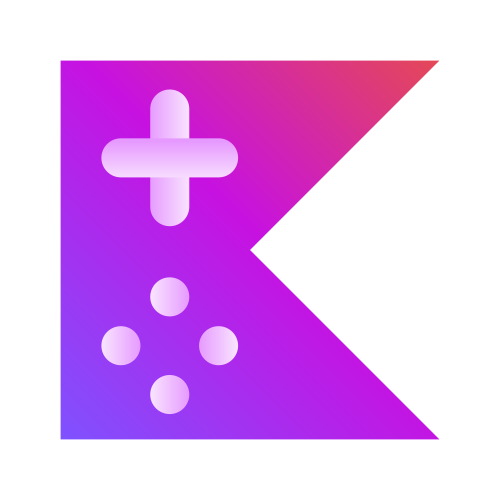

<div align="left">
    
</div> 

# Kotlin Playground - Desktop App

This is a desktop app built with Electron, which can be used to practice coding in Kotlin Language. The app is best suited for Android developers.

The app uses Kotlin Compiler Playground from SoloLearn (www.sololearn.com/en/compiler-playground/kotlin). 

It gives a convenient way to test and run Kotlin codes without needing to open a web browser or use any heavy IDE for practising code.

## Screenshots

* ### Main Screen (Empty Compiler Tab selected by default)


## Features

*   **Tabbed Interface:**  Organize your Kotlin coding sessions with multiple tabs, each running a separate instance of the Kotlin Playground.
*   **Easy Navigation:** Use the built-in navigation buttons (Back/Forward) or keyboard shortcuts (Alt+Left or Alt+Right) to navigate within each tab.
*   **Reload Functionality:** Refresh the content of any tab with a Reload button from the menu or with keyboard shortcut.
*   **Tab Renaming:** Double click on tab name to rename it.
*   **Tab Deletion:** Close tabs as needed.
*   **Zoom Control:** Zoom in and out using standard keyboard shortcuts (Ctrl ++ or Ctrl +- or Ctrl+0)

## Technologies Used

*   **Electron:** Framework for building cross-platform desktop applications with web technologies.
*   **HTML, CSS, JavaScript:** Used for the user interface and application logic.
*   **SoloLearn Kotlin Playground:** The web-based Kotlin execution environment integrated into the app.

## How to Use

1.  Launch the application.
2.  The application will open with two default tabs: "Compiler" and "Profile".
3.  The 'Compiler' tab has default kotlin editor opened and the 'Profile' tab contains our saved kotlin program codes.
4.  Use the Kotlin Playground within each tab as you normally would on the SoloLearn website.
7.  Double-click on a tab name to rename it.
8.  Click the "x" button on a tab to close it.
9.  Use Ctrl+ +/-/0 to zoom in, out, and reset the zoom level.


## Installation

1.  **Clone the Repository:**

    ```bash
    git clone https://github.com/ayushpadlekar/kotlin-playground.git
    ```

2.  **Navigate to the Project Directory:**

    ```bash
    cd kotlin-playground
    ```

3.  **Install Dependencies:**

    ```bash
    npm install
    ```

4.  **Run the Application:**

    ```bash
    npm start
    ```


## Contributing

Contributions are welcome! Feel free to submit pull requests or open issues.
